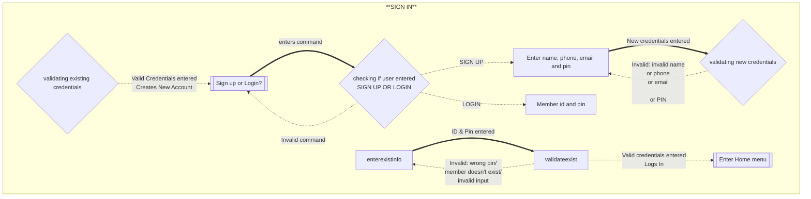
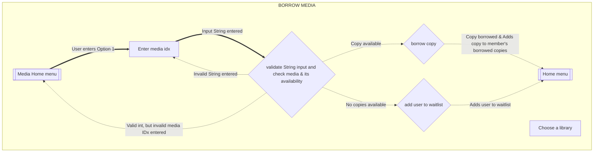
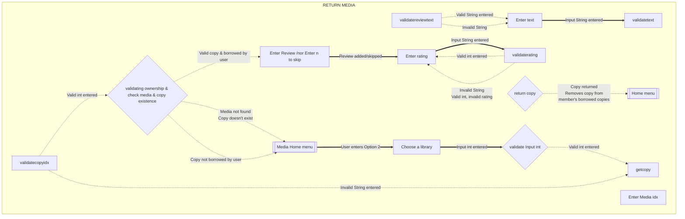
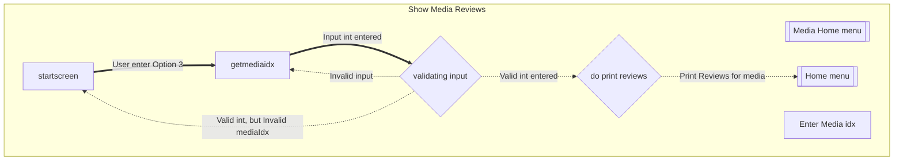
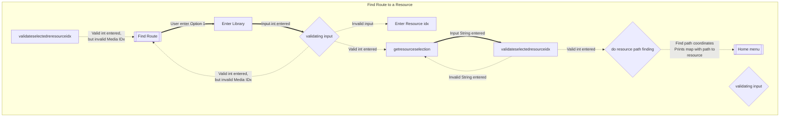
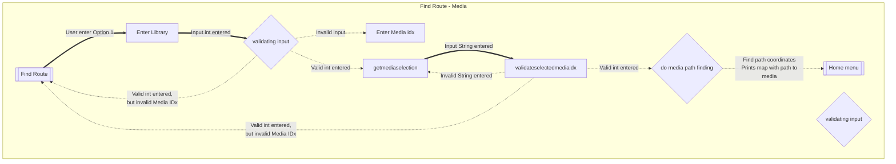
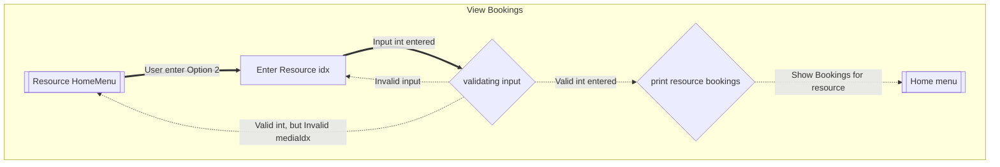
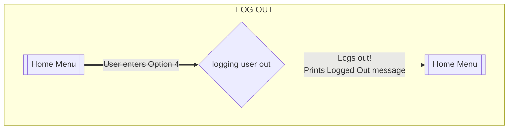

# Overview
**Jola City Library System** is an implementation of a city-wide library management system for COMP 2450 (Fall 2025).

This project now supports both the original domain model (Phase 1) and the new interactive functionality required for Phase 2, including:

* Managing libraries, members, media (books, DVDs, games), and bookable resources.
* Multiple copies of media, enforcing one active loan per copy.
* Borrowing and returning media with due dates and overdue checks.
* Waitlists for media that are fully checked out.
* Booking of resources (e.g., study rooms, computers) with no overlapping times.
* Viewing and searching available timeslots for resources.
* Members with contact information and account restrictions (e.g., blocked if overdue).
* Reviews for both media and resources.
* An ASCII-art floor map per library, with a legend.
* Path-finding from a kiosk to a media or resource location using a stack-based algorithm.
  
The system is implemented with a (REPL) that lets users
enter commands interactively to add, show, and remove data in a live session.

## Resources
* Patrick Dubois lecture slides.
* Franklin Bristow youtube video <https://www.youtube.com/live/2faoHFku-5I?si=QjmU_HlgLfWip8XQ>
* In Phase II, additional resources were consulted to design user interaction flows and UI structure:
* DFS Pathfinding tutorials (used to understand stack-based DFS algorithm)
* Example code snippets from Franklin's Git Repository at <https://code.cs.umanitoba.ca/comp2450-fall2025/2450-emon/-/tree/main>.

# Running
* The functional application can be started by running the `main` method in `LibraryAppMain`

## Diagrams

# Flows of interaction

 Here is the flowchart for the "SIGN In" task in library model.

### Sign IN

Here is the flowchart for the "Borrow media" task in Library model.

### BORROW MEDIA

Here is the flowchart for the "Return media" task in Library model.

### Return Media

Here is the flowchart for the "Show Media Reviews" task in Library model
### Show Media Reviews

Here is the flowchart for the "Book a resource" task in Library model.
### Book a Resource

```mermaid
flowchart
  subgraph **BOOK RESOURCE**
    startscreen[[Resource HomeMenu]]
    getlibrary[Enter Library]
    getresourceidx[Enter Resource idx]
    gettdorodorc[TD or ROD or C]
    gettd[Enter date]
    getrodstart[Enter Start Date]
    getrodend[Enter End Date]
    getrod[Enter Preferred Date]
    picktdtime[Enter Time]
    pickrodtime[Enter Time]
    endscreen[[Main menu]]
    
    validatelibrary{checking if user selected library}
    validatetdorrodorc{checking if User entered TD or ROD}
    validatetd{validating String}
    validaterodstart{validating String}
    validaterodend{validating String}
    validaterod{validating String}
    showtd{checking and showing available bookings}
    validatetdtime{validating String}
    validaterodtime{validating String}
    createtdbooking{do booking}
    createrodbooking{do booking}

    startscreen== User enters Option 1 ==> getlibrary
    getlibrary== Input entered ==> validatelibrary
    validatelibrary -. Invalid Input entered .-> getlibrary
    validatelibrary -. Valid int entered .-> getresourceidx
    getresourceidx== Input String entered ==> validateresourceidx
    validateresourceidx -. Invalid String entered .-> getresourceidx
    validateresourceidx -. Valid int, but invalid resource IDx.-> startscreen
    validateresourceidx -. Valid int entered .-> gettdorrodorc
    gettdorrodorc == Input String entered ==> validatetdorrodorc
    validatetdorrodorc -. User entered invalid command .-> gettdorrodorc
    validatetdorrodorc -. User entered C .-> startscreen
    validatetdorrodorc -. User entered ROD .-> getrodstart
    validatetdorrodorc -. User entered TD .-> gettd

    gettd == Input String entered ==> validatetd
    validatetd -. Invalid String entered .-> gettd
    validatetd -. Valid Date entered .-> showtd
    showtd -. Available times printed .-> picktdtime
    picktdtime == Input String entered ==> validatetdtime
    validatetdtime -. Invalid Time String entered .-> picktdtime
    validatetdtime -. Valid Time String entered .-> createtdbooking
    createtdbooking -. Booking confirmed!\n Adds to Resource booking list .-> endscreen

    getrodstart == Input String entered ==> validaterodstart
    validaterodstart -. Invalid String entered .-> getrodstart
    validaterodstart -. Valid Start Date entered .-> getrodend
    getrodend == Input String entered ==> validaterodend
    validaterodend -. Invalid String entered .-> getrodend
    validaterodend -. Valid End Date entered .-> getrod
    getrod == Input String entered ==> validaterod
    validaterod -. Invalid String entered .-> getrod
    validaterod -. Valid Date, Invalid Preferred Date entered .-> getrod
    validaterod -. Valid Date entered .-> pickrodtime
    pickrodtime == Input String entered ==> validaterodtime
    validaterodtime -. Invalid Time String entered .-> pickrodtime
    validaterodtime -. Valid Time String entered .-> createrodbooking
    createrodbooking -. Booking confirmed!\n Adds to Resource booking list .-> endscreen
    
  end
```

Here is the flowchart for the "Find Path to a Resource" task in library model
###  Find Route to a Resource

Here is the flowchart for the "Find path to a media" task in library model
### Find Route - Media

Here is the flowchart for the "View bookings" task in library model
### View Bookings

Here is the flowchart for the "Log out" task in library model
### LOG OUT

## Changes from Phase 1

Since Phase 1, I have updated the domain model to support the Phase 2 requirements:

* Added a `Coordinate` record and attached a `location: Coordinate` to both `Media` and `Resource` to model where items are physically located on the `FloorMap`.
* Added a `Stack<T>` interface and a `LinkedStack<T>` implementation, used by the `PathFinder` class to implement stack-based path finding.
* Added a `PathFinder` helper class that computes a path from one `Coordinate` to another on a `FloorMap`, only walking through valid cells.
* Extended `Copy` to track the `borrowedBy` member and `dueDate` and added `borrow`, `returnCopy`, and `isOverdue` methods.
* Extended `LibrarySystem` with higher-level operations:
    * `registerMember` with stronger checking and custom exceptions.
    * `hasOverdueMedia`, `borrowMedia`, and `returnMedia` to implement borrowing, waitlists, reviews on return, and overdue blocking.
* Extended `Resource` with an explicit `location` and an `addBooking` method that enforces the invariant that bookings do not overlap.
* Kept and strengthened class invariants for all data classes, and used them as preconditions and postconditions in mutating methods.

## Domain model
## Here is the diagram for my model

```mermaid
classDiagram
    class LibrarySystem {
    - Map<String, Library> libraries
    - Map<Integer, Member> members
    - int nextMemberId
    - static int MAX_ACTIVE_LOANS

    + addLibrary(lib) void
    + addMember(m) void
    + registerMember(firstName, lastName, phone, email, pin) Member
    + findMemberById(memberId) Member
    + hasOverdueMedia(member, today) boolean
    + borrowMedia(library, mediaId, member, today) void
    + returnMedia(library, mediaId, copyBarcode,member, today,ratingOrNull, reviewTextOrNull) void
}
note for LibrarySystem "Invariants:
    * libraries != null
    * loop: all keys != null, all values != null (Library)
    * members != null
    * loop: all keys != null, all values != null (Member)
    * nextMemberId >= 1000 (system starts at 1001)
    * MAX_ACTIVE_LOANS = 10 (constant)
    "

class Library {
    -UUID id
    -String name
    -String address
    -FloorMap map
    -Map~String, Media~ media
    -Map~Integer, Resource~ resources
    
    
    +addMedia(m) void
    +addResource(r) void
    +requireMedia(mediaId) media
    +requireResource(resourceId) resource
}
note for Library "Invariants Properties:
    * id != null
    * name != null
    * name.length() >= 1
    * Address.length() >= 1
    * mediaCollection != null
    * loop: all Media in mediaCollection are not null
    * typeOfResource != null
    * loop: all Resources in typeOfResource are not null
    * Map != null
    "

class Member {
    -int  memberId
    -String firstName
    -String lastName
    -String phoneNumber
    -String email
    -String pin
    -boolean canBorrow
    -Map<String, localDate> borrowedCopies;
    
    +addBorrowedCopy(copyKey, due) void
    +removeBorrowedCopy(copyKey) void
    +activeLoanCount() int
    +underLoanLimit(max) boolean
    
}
note for Member "Invariants Properties:
    * memberName != null
    * memberName.length() >= 1
    * memberId > 0
    * email != null 
    * email.length() >= 1
    * email contains '@' character to make it valid
    * phoneNumber != null
    * phoneNumber.length() == 11
    * pin != null
    * pin.length() == 4
    * borrowedCopies != null
    * borrowedCopies.size() <= maxActiveLoans
    * loop : all copies and due dates in borrowedCopies cannot be null
    "

class Media {
    -UUID id
    -String title
    -String creator
    -MediaType kind
    -MediaCategory category
    -Coordinate location
    -int available_copies
    -Map~String, Copy~ mediaCopies
    -Deque~Member~ waitlist
    -List~Review~ reviews
    
    +addCopy(copy: Copy) void
    +joinWaitlist(member: Member) void
    +pollNextFromWaitlist() Member
    +addReview(memberId, rating, reviewText) void
}
note for Media "Invariants Properties:
    * title != null
    * title.length() >= 1
    * id != null
    * Creator != null
    * Creator.length() >= 1
    * kind != null
    * category != null
    * location != null
    * reviewsCollection != null
    * loop: all reviews in Reviews list cannot be null 
    * mediaCopies != null
    * loop: all media copies in mediaCopies Map cannot be null
    * Waitlist != null
    * loop: all members in mediaWaitlist cannot be null 
    "

class Copy {
    -String barcode
    -copyStatus Copy
    -Integer borrowerId
    -LocalDate dueDate
    
    +borrow(memberId, dueDate) void
    +returnCopy() void
    
}
note for Copy "Invariants properties:
* barcode != null 
* status != null
* if(status == AVAILABLE) then (borrowerId == null)
* if(status == AVAILABLE) then (dueDate == null)
* if(status != AVAILABLE) then (borrowerId > 0)
* if(status != AVAILABLE) then (borrowerId != null)
* if(status != AVAILABLE) then (dueDate != null)
"

class Resource {
    -int resourceId
    -String resourceName
    -ResourceType kind
    -String description
    -Coordinate location
    -Map<Integer, Booking> bookinglist
    -List~Review~ reviews
    
    +addBooking(booking: Booking) void
    +isAvailableDuring(start, end) boolean
}
note for Resource "Invariants properties:
* resourceId > 0
* resourceName must not be null
* resourceName.length > 0 
* kind != null
* description != null
* description.length > 0
* bookingList != null
* all Booking in bookingList cannot be null
* reviewList != null
* all reviews in reviewList cannot be null
* location != null"

class Booking {
    <<record>>
    +int bookingId
    +int resourceId
    +int memberId 
    +LocalDateTime start
    +LocalDateTime end
}
note for Booking "Invariants properties:
    * bookingId > 0
    * resourceId > 0
    * memberId > 0
    * start != null
    * end != null
    * start is always before end
    "
class Review {
    <<record>>
    +int memberid
    +int rating
    +String text
}
note for Review "Invariants properties:
* memberId > 0 
* text != null
* text must be non-empty
* 1 <= rating <= 5"

class FloorMap {
    -int width
    -int height
    -char[][] grid
    -Map~char, String~ legend
}
note for FloorMap "Invariants properties:
* width, height > 0
* grid != null, grid.length == height
* each row non-null and length == width
* legend != null and contains no null keys/values"

class Coordinate {
    <<record>>
    +int row
    +int col
}

class Stack~T~ {
    <<interface>>
    +push(item: T) void
    +pop() T
    +peek() T
    
    +isEmpty() boolean
    +size() int
}

class LinkedStack~T~ {
    -Node~T~ top
    -int size
    +push(item: T) void
    +pop() T
    +peek() T
    
    +isEmpty() boolean
    +size() int
}
    note for LinkedStack "Invariants properties:
* size >= 0
* size == 0 & top == null
* size > 0 top != null"

class MediaType {
    %%different types of media
    <<enumeration>>
    BOOK
    DVD
    GAME
    BLURAY
    EBOOK
}

class MediaCategory {
    %% different categories for media
    <<enumeration>>
    FICTION
    NON_FICTION
    SCIENCE
    FANTASY
    HISTORY
    BIOGRAPHY
    CHILDREN
}

class ResourceType {
    %% different types of resources 
    %% that can be found in the library
    <<enumeration>>
    ROOM
    COMPUTER
    STUDY_DESK
    PRINTER
}


%% these are composition relationship
Library --* FloorMap
Library --* Media
Library --* Resource
Media --* Copy
Media --* Review
Resource --* Booking
Media --* MediaType
Resource --* ResourceType
Media --* MediaCategory
FloorMap --* Coordinate
Resource --* Review

%% these are aggregate relationship
LibrarySystem --o Library
LibrarySystem --o Member
Booking --o Member
Review --o Member

LinkedStack~T~ ..|> Stack~T~
```

